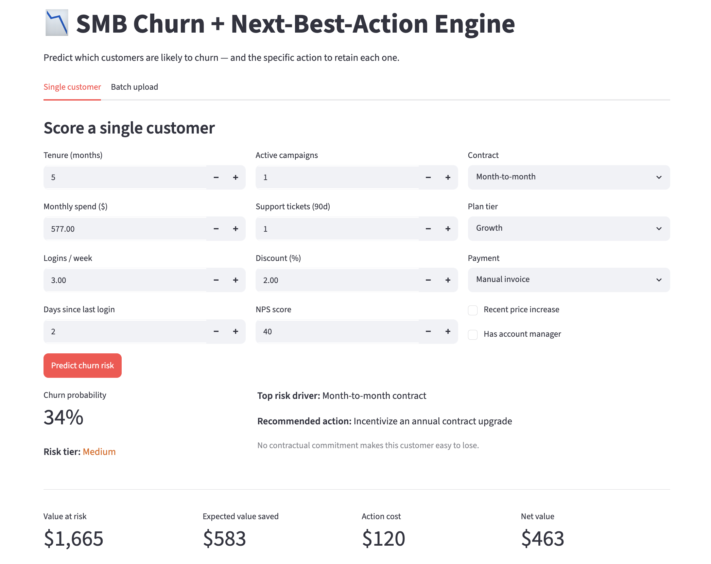

# SMB Churn + Next-Best-Action Engine

[](https://github.com/dustintdn/churn-nba-dev/actions/workflows/ci.yml)

Predicts which SMB subscription customers are likely to churn, explains why, and
recommends a costed retention action for each one. The trained pipeline is served
through a FastAPI endpoint and a Streamlit dashboard.

## Business Question

For a small/mid-size-business (SMB) subscription platform: which accounts are most
likely to cancel, and what is the single most useful retention action for each one?

## Approach

I train an XGBoost classifier and compare it against a logistic-regression baseline
on held-out PR-AUC; whichever wins gets calibrated (isotonic) and deployed. SHAP
identifies the dominant churn driver per customer, and a rules layer maps that driver
to a retention action with an estimated cost and lift (discount, support call,
re-onboarding, etc.). The full preprocessing + model pipeline is serialized as one
artifact and served by FastAPI, so training and serving share the same code path.

## Key Findings

- **Top churn drivers:** month-to-month contracts, support-ticket volume, recent
  price increases, and low product engagement raise risk. Tenure, NPS, and having
  a dedicated account manager lower it.
- **Model selection:** the tuned XGBoost (via `RandomizedSearchCV`) narrowly beat
  the logistic baseline on PR-AUC (0.574 vs 0.571) and was deployed. ROC-AUC 0.84,
  PR-AUC 0.57 against a ~17% base churn rate, about a 3.4x lift. Probabilities are
  isotonic-calibrated, so a 30% score corresponds to roughly 30% observed churn.
- **At the decision threshold:** if the retention team works the top 15% of accounts
  by risk, they reach ~52% of all churners at ~58% precision, versus 17% precision
  calling at random.
- **Ranking by dollars beats ranking by risk:** ordering the worklist by expected
  net value instead of churn probability captures ~58% more retention value at the
  same team capacity (about $142k vs $90k on the held-out set in the notebook).
  A moderate-risk account spending $2,000/mo is usually worth more attention than
  a near-certain churner spending $100/mo.

## From Prediction to Action

For each at-risk customer, the recommendation layer reads the strongest churn driver
and picks a matching action with a one-line rationale. A high-risk account flagged
for a recent price increase with little existing discount gets *"Offer a loyalty
discount / lock-in pricing"*; a disengaged account gets re-onboarding outreach; a
high-support-volume account gets a proactive senior-rep call. The economics layer
then prices the action (value at risk, expected value saved, net value, ROI) so the
team can work a dollar-ranked worklist. Low-risk customers get no intervention.

### How the economics work

Each customer's dollar impact comes from four values:

| Metric | Formula | Example (85% churn risk, $520/mo spend) |
|---|---|---|
| Customer value | monthly spend × 12-month horizon × 70% gross margin | $520 × 12 × 0.70 = $4,368 |
| Value at risk | churn probability × customer value | 0.85 × $4,368 = $3,713 |
| Expected value saved | churn probability × action lift × customer value | 0.85 × 0.30 × $4,368 = $1,114 |
| Net value | expected value saved − action cost | $1,114 − $150 = $964 |

Each action type has its own cost and lift (a loyalty discount costs $150 with 30%
lift; assigning an account manager costs $500 with 40% lift). The margin, horizon,
and per-action numbers all live in `src/economics.py`.

**These are assumptions, not measured effects.** In production, each action's cost
and lift would be estimated from holdout A/B experiments. They are centralized in
`ACTION_ECONOMICS` so they can be replaced as real data comes in.

## Production

The fitted pipeline (`models/churn_model.joblib`) is served by a FastAPI app
(`src/api.py`) exposing:

- `GET /health` — liveness + model-readiness probe
- `POST /predict` — accepts a Pydantic-validated customer record; returns the
  calibrated churn probability, the recommended action, and its expected-value
  economics
- `POST /predict/batch` — scores a list of records and returns them ranked by
  expected net value (worklist order)

**Example request:**

```bash
curl -X POST http://127.0.0.1:8000/predict \
  -H "Content-Type: application/json" \
  -d '{
    "customer_id": "SMB-00042",
    "tenure_months": 14,
    "contract_type": "Month-to-month",
    "plan_tier": "Growth",
    "payment_method": "Credit card",
    "monthly_spend": 520,
    "logins_per_week": 3.0,
    "last_login_days": 12,
    "active_campaigns": 3,
    "support_tickets_90d": 1,
    "discount_pct": 5.0,
    "price_increase_recent": 1,
    "has_account_manager": 0,
    "nps_score": 20
  }'
```

**Example response:**

```json
{
  "customer_id": "SMB-00042",
  "churn_probability": 0.8563,
  "risk_tier": "High",
  "top_driver": "Recent price increase",
  "recommended_action": "Offer a loyalty discount / lock-in pricing",
  "rationale": "Customer absorbed a recent price increase with little existing discount.",
  "value_at_risk": 3740.38,
  "expected_value_saved": 1122.11,
  "net_value": 972.11,
  "roi": 6.48
}
```

### Interactive dashboard

A Streamlit dashboard wraps the same model for non-engineers: score one customer
from a form, or upload a CSV and download a ranked action worklist. It shows the
predicted churn probability and risk tier, the top risk driver and recommended
action, and the expected-value economics.



```bash
streamlit run app/dashboard.py     # opens at http://localhost:8501
```

### Batch scoring

Score an entire customer file into a ranked worklist:

```bash
python -m src.batch_score --input data/customers.csv --output data/scored_customers.csv
```

## How to Run

```bash
# 1. Install dependencies
pip install -r requirements.txt

# 2. (Optional) regenerate the synthetic dataset
python src/generate_data.py

# 3. Train the model (baseline comparison + tuning) -> writes models/churn_model.joblib
python src/train.py            # add --fast to skip the hyperparameter search

# 4. Run the tests
pytest

# 5. Launch the serving API ...
uvicorn src.api:app --reload   # docs at http://127.0.0.1:8000/docs
#    ... or the dashboard
streamlit run app/dashboard.py

# 6. Explore the full analysis
jupyter notebook notebooks/churn_analysis.ipynb
```

### Run with Docker

Bring up the API and the dashboard together:

```bash
docker compose up        # API on :8000, dashboard on :8501
```

## Project Structure

```
churn-nba-dev/
├── README.md
├── requirements.txt
├── Dockerfile / docker-compose.yml   # API + dashboard
├── data/
│   ├── README.md              # data dictionary (column definitions)
│   └── customers.csv          # synthetic SMB customer dataset
├── notebooks/
│   └── churn_analysis.ipynb   # 5-phase analysis (EDA -> model -> SHAP -> NBA)
├── app/
│   └── dashboard.py           # Streamlit consumer (single + batch scoring)
├── src/
│   ├── generate_data.py       # reproducible synthetic data generator
│   ├── train.py               # model selection + calibrated pipeline -> joblib
│   ├── recommend.py           # next-best-action rules layer
│   ├── economics.py           # expected-value / ROI layer
│   ├── batch_score.py         # score a whole file into a ranked worklist
│   └── api.py                 # FastAPI serving app
├── tests/                     # NBA rules, API integration, end-to-end model
└── models/
    └── churn_model.joblib     # serialized serving-ready pipeline
```

See [`MODEL_CARD.md`](MODEL_CARD.md) for the model's intended use, training data, evaluation, and limitations.

## Caveats

- **Synthetic data.** The dataset is simulated (`src/generate_data.py`) with a known
  churn relationship so the repo is fully reproducible without external credentials.
  On real data the feature set, drivers, and metric levels would differ; the
  methodology is what transfers.
- **NBA rules are hypotheses.** The action mappings are reasonable starting points,
  but each rule's retention lift would need validation with a holdout A/B experiment
  before the business relies on it.
- **Point-in-time scoring.** The model scores a snapshot of customer state. A real
  deployment would add monitoring for feature/label drift and periodic recalibration.
